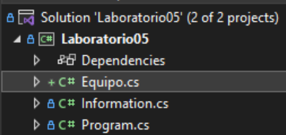
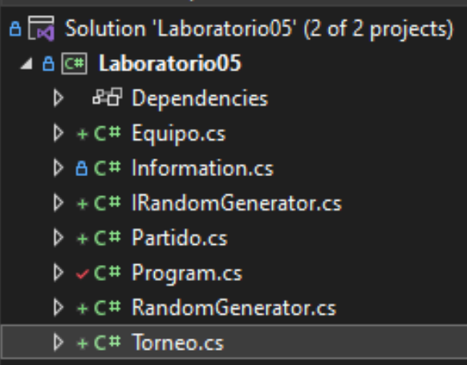
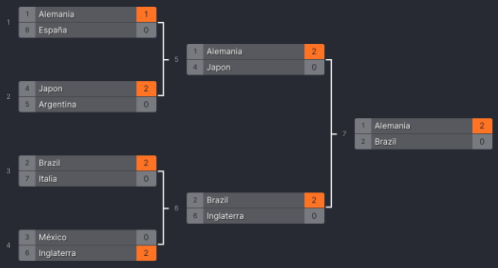

# Laboratorio 04

## Introducción

El objetivo de este laboratorio es crear un simulador de torneos de fútbol. En los siguientes ejercicios se utilizará Programación Orientada a Objetos (OOP) para lograr el objetivo.

## Clonando el código

1. Para iniciar el laboratorio, debe crear un *Fork* del repositorio:

    

2. Clone el nuevo repositorio en su computadora y ábralo en Visual Studio.

3. Abra el archivo **Information.cs**

    

4. Modifique el archivo para que retorne su nombre, carnet y sección

    |  |
    |:--:|
    | *Ejemplo 0.1: Mostrando la información del estudiante* |

___

## Ejercicio 1

1. Abra la clase **Equipo**.

    

2. Modifique la clase para que tenga los siguientes atributos **privados**:

    - Nombre
    - Partidos ganados
    - Partidos empatados
    - Partidos perdidos
    - Goles a favor
    - Goles en contra

3. Modifique el constructor de la clase para asignar los valores a los atributos de la clase.

4. En el constructor, agregue las siguientes validaciones:

    - La suma de partidos ganados, empatados y perdidos debe ser igual a 3
    - Tanto los goles a favor como en contra deben ser mayores o iguales a 0

    Si alguna de las validaciones falla, debe lanzar una excepción:

    ```c#
    throw new Exception("Revise el equipo. La sumatoria de partidos debe ser igual a 3 y los goles anotados y a favor deben ser mayores o iguales a cero.");
    ```

5. Modifique los métodos de Get para que retornen los atributos correspondientes.

6. En el archivo **Program.cs**, modifique el método **Main** para crear dos nuevos equipos, asigne valores válidos e imprima los datos de cada equipo en pantalla:
    |  |
    |:--:|
    | *Ejemplo 1.1: Creando un equipo* |

___

## Ejercicio 2

1. Abra la clase **Partido** y modifique el constructor para que los atributos `equipo1` y `equipo2` sean asignados con los parámetros correspondientes. El atributo `ganador` se calculará hasta que se llame a la función `SeleccionarEquipoGanador()`. Mientras dicha función no se llame, `ganador` será `null`.

2. Modifique la función `SeleccionarEquipoGanador()` para que cacule, solo una vez, el equipo ganador del partido. Al llamar la función una segunda vez, se debe retornar siempre el mismo equipo.

    El equipo ganador debe ser el equipo que mayor puntaje obtenga de la siguiente fórmula:

    ```math
    P = x * (((PG*0.7) + (PP*0.1) + (PE*0.2)) / (GF-GA+0.001))
    ```

    Donde,

    |||
    |--|--|
    |PG|Partidos Ganados|
    |PP|Partidos Perdidos|
    |PE|Partidos Empatados|
    |GF|Goles a Favor|
    |GC|Goles en Contra|
    |x|Número aleatorio entre -1.0 y 1.0|

    El puntaje de cada equipo debe calcularse hasta que los dos equipos tengan puntajes distintos.

    **Para generar un número aleatorio entre -1.0 y 1.0 utilice:**

    ```c#
    IRandomGenerator.RandomGenerator.Next()
    ```

3. En **Program.cs** cree un partido entre los dos equipos que creó previamente y llame a la función `SeleccionarEquipoGanador` más de una vez e imprima los resultados del equipo ganador después de cada llamada a `SeleccionarEquipoGanador`.

### Ejemplo 2.1

```C#
// equipo1="Marruecos", equipo2="Argentina"
Partido partido = new Partido(equipo1, equipo2);

for (int i = 0; i < 3; i++) {
    Console.WriteLine(partido.SeleccionarEquipoGanador().GetNombre());
}
```

En consola se imprime:

```bash
"Argentina"
"Argentina"
"Argentina"
```

___

### Ejercicio 3

1. Abra la clase **Torneo.cs**

    

2. Modifique la función **estática** `SimularTorneo` considerando lo siguiente:

    - Un torneo debe componerse de al menos dos equipos.
    - La cantidad de equipos debe ser una potencia de dos (ejemplo: 2, 4, 8, 16, 1024).
    - Si ninguna de las dos condiciones previas se cumple, lance una excepción:

    ```c#
    throw new Exception("La cantidad de equipos debe ser una potencia de dos y deben existir al menos dos equipos");
    ```

    - Por cada dos equipos debe crearse un **Partido**, el ganador de cada partido pasa a la siguiente ronda.
    - En cada ronda, el equipo `0` se enfrentará al equipo `n-1`, `1` vs `n-2` y así sucesivamente. Es decir, cada partido se conformará de la siguiente forma `equipos[i]` **vs** `equipos[n-i-1]`, donde n es la cantidad de equipos en la ronda.
    - El equipo ganador de cada partido se obtiene del resultado de `SeleccionarGanador()`.
    - La función `SimularTorneo` debe retornar un arreglo de dos dimensiones, en donde cada dimensión del arreglo representa los equipos de restantes de cada ronda. La última posición del arreglo tendrá el equipo campeón del torneo.

3. Modifique la función **Main** de **Program.cs** para crear un torneo de 8 equiposß y muestre los nombres de cada equipo en cada fase del torneo. ¿Cuál es la diferencia de llamar al método `SimularTorneo` respecto a los demás métodos? ¿En qué se parece `SimularTorneo` respecto a la forma de obtener un número aleatorio entre -1.0 y 1.0?

### Ejemplo 3.1

```none
equipos = ["Argentina", "Brasil"]
resultado = [["Argentina, "Brasil"], ["Argentina"]]
```

**Explicación:** El torneo se encuentra compuesto por dos equipos únicamente, el resultado muestra la primera ronda y única ronda (Argentina vs Brasil) y en la última posición del resultado se muestra el campeón que es Argentina.

___

### Ejemplo 3.2

```none
equipos = ["Bayern Munich", "PSG", "Manchester City", "Municipal"]
resultado = [["Bayern Munich", "PSG", "Manchester City", "Municipal"], ["Municipal", "PSG"], ["Municipal"]]
```

**Explicación:** El torneo se encuentra compuesto por cuatro equipos, el resultado muestra la primera ronda, la cual siempre coincidirá con el arreglo de equipos, pues son quienes conforman la primera ronda. En la primera ronda, se enfrentarán `Bayern Munich vs Municipal` y `PSG vs Manchester City`, los ganadores de cada partido son `Municipal` y `PSG`, respectivamente. Dejando la final `Municipal vs PSG` y el resultado del partido deja a `Municipal` como campeón.

___

### Ejemplo 3.3

```none
equipos = ["Alemania", "Japón", "Brazil", "México", "Inglaterra", "Italia", "Argentina", "España"]
resultado = [["Alemania", "Japón", "Brazil", "México", "Inglaterra", "Italia", "Argentina", "España"], ["Alemania", "Brasil", "Inglaterra", "Japón"]. ["Alemania", "Brazil"], ["Alemania]]
```


___
